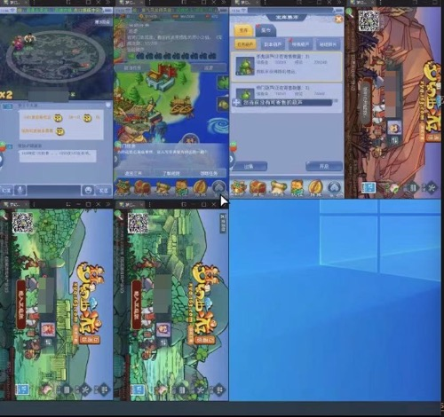

# 副业探索之梦幻西游搬砖

## 一、背景
2个多月前，有个朋友找到我，说让我改一个外挂。第一感觉是这么高端的东西，我肯定搞不定，于是说，外挂这种东西需要高深的计算机基础，我可能做不了：）。朋友说，你先看看，有源码，这是他另一个朋友花钱找别人写的。我说行吧，然后他把源码发给了我，我大概瞅了一眼，这玩意不是内存挂，是自动化脚本，于是我说研究一下的话应该问题不大。看完最终代码发现这个人写的是一个大循环，运行效率极低，所以又重新写了这个。

## 二、搬砖背景介绍
也许你听到梦幻西游，你会觉得，卧槽，这不是好好多年前的游戏了嘛，现在还有人玩吗？没错，这也是我的第一反应，但是当你通过互联网搜索的时候，你会发现这个游戏还活得很好，而且很多人正在靠这个赚钱，而且梦幻赚钱的途径五花八门，任何一条线抽出来都能赚钱，而且官方还出了一个专门的交易平台藏宝阁，也就是说其实官方为了让这个游戏活下去，变相的允许你搬砖。

我写的这个脚本主要针对梦幻西游口袋版，先说下好处吧。

1、相对来说不会占用你太多时间，因为有脚本自己挂机，看你账号的数量，我现在100个号，一般一个月左右收一次物品，然后卖钱。

2、属于饲养性产业，只要不被封号，可以一直有产出。

3、盈利我觉得还行吧，用我这个脚本平均一个月一个号10-15块钱

再来说一下坏处：

1、前期投入不小，电脑钱，买号钱，买的号都是沉默号，需要每个号冲50块钱解沉默，不过这50块钱在15天之后基本是能通过口袋版的兵器库刷会40块钱，电话卡钱。

2、前期操作比较繁琐，一个电话卡只能绑30个梦幻账号，电话卡是虚拟号，一张电话卡只能解除两次风险验证，一个身份证可以绑定100个梦幻账号。

3、游戏币上架藏宝阁的时候需要有三界，需要去藏宝阁买一个有三界的号，一般80个号需要6000三界，才能把所有游戏币换成人民币

4、需要不同的ip（已有解决方案，不懂问我），账号可能会被封，根据同一个ip的登录次数

当然里面有太多细节，一时半会说不清楚，这种事当个副业还是挺不错的，反正我已经试错快3个月了，对于程序员群体来说，我们更适合做搬砖。
当然这个仓库也会继续分享关于副业的探索。

**忘记说了，这个脚本依赖一个叫触动精灵的app。**

突然想到公开代码会有风险，还是不公开代码了。。。。

